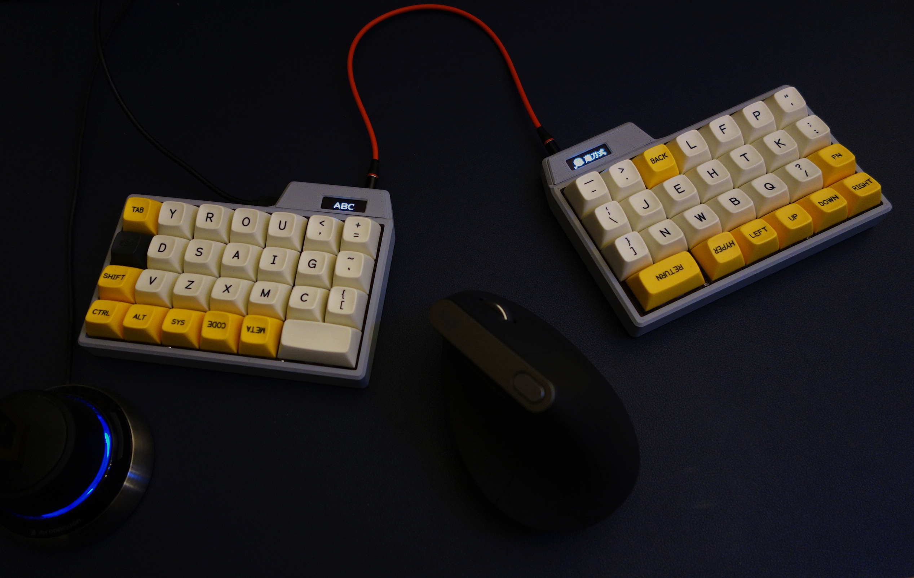

# 742 KEYBOARD

742はOLED搭載、54キーの分割キーボードです。
ファームウェアは [QMK](https://github.com/eswai/qmk_firmware/tree/master/keyboards/eswai/742) を参照ください。

本キーボードはMITライセンスです。

foostan氏のKiCADライブラリ[kbd](https://github.com/foostan/kbd)を使用させていただきました。

